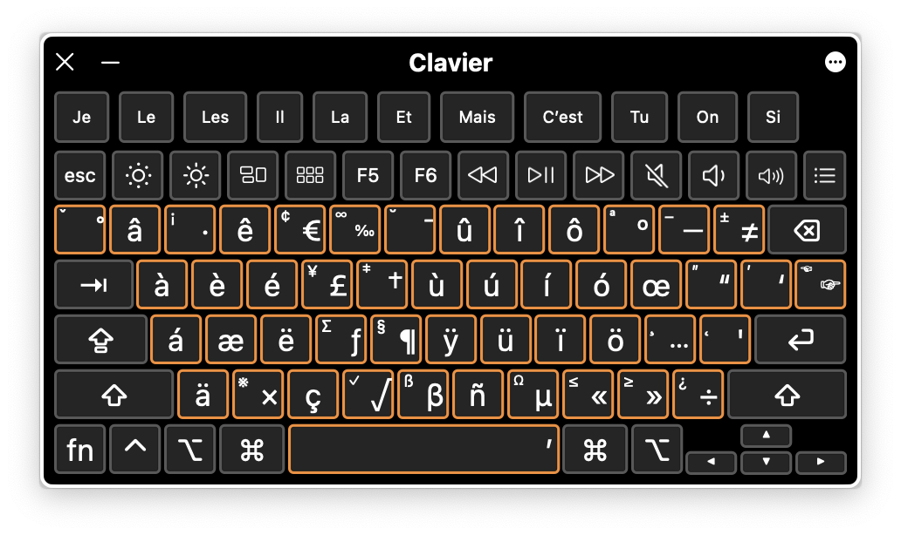

# Qwérty

A smart keyboard layout that allows you to type in any Latin language on QWERTY keyboards with only a single dead key.

*This layout is under development and shouldn’t be used in production. ISO, Windows and GNU/Linux versions to come.*

## Licence

EUPL 1.2.